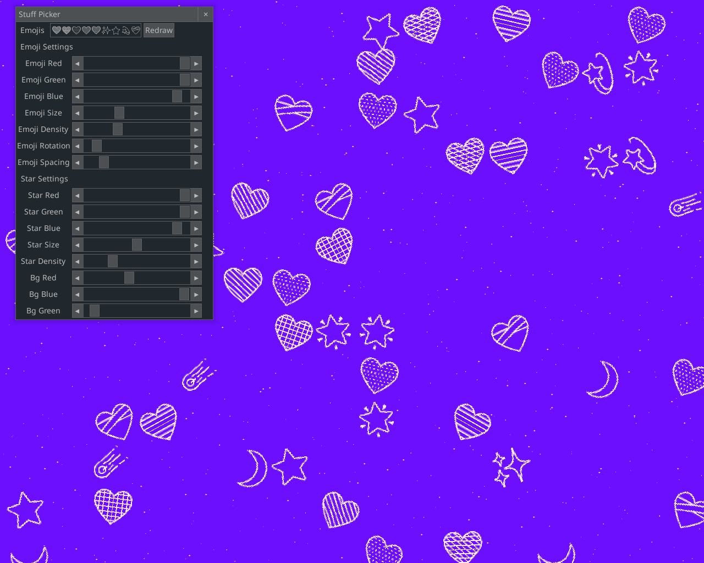

**README.md**

# Emoji Wallpaper Generator 🎉

Welcome to the **Emoji Wallpaper Generator**, the ultimate meme‑powered tool for turning your screen into a kaleidoscope of emojis, stars, and custom color schemes! 🚀✨

## What’s This All About?

- **💥 Random Emoji Spread** – Let the emojis dance across your display like a TikTok trend.  
- **🖌️ Color & Background Schemes** – Choose a vibe (solid color + background *or* an epic preset scheme) – you can’t mix them, but that’s just to keep things tidy.  
- **⭐ Star‑tastic Overlays** – Sprinkle random stars over the empty spaces for that “galaxy vibes” look.  

## Core Components

| File | Role |
|------|------|
| **`engine.py`** | The brain of the app – initializes functions, renders emojis (fillscreen or spread), handles events, and drives the main loop. |
| **`gui.py`** | Simple Pygame GUI for color picking (future sliders coming soon). |
| **`main.py`** | Entry point – sets up the `Engine`, runs the game loop, and quits gracefully. |
| **`notoFillscreen.py`** | Minimal rendering stub that prints three default characters (placeholder for full Noto implementation). |
| **`notoSpread.py`** | The heavy‑lifting class: creates emoji surfaces, spaces them out, adds stars, and can rotate emojis for extra flair. |

## How to Run

```
pip install -r requirements.txt
python main.py
```

## Example Output




## Future Roadmap

- **🔧 Slider Widgets** – Add real-time sliders for color/alpha tweaks.   
- **🖼️ Emoji Picker UI** – Drag‑and‑drop your favorite emojis into the canvas.  

---

*Made with love, Pygame, and a sprinkle of nostalgia—just like that one‑second video you can’t stop replaying.* 🎈

--- 

Feel free to fork, contribute, I really dont care about this project.